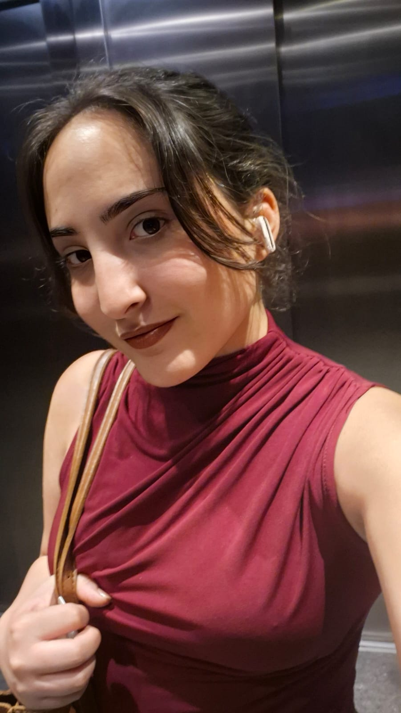

# 📸 Profile Photo App

## About the Project

I originally created this application for a feature I wanted to use on my phone, but when I couldn't get the result I wanted, I decided to build it together with Gemini. The result is a simple yet useful tool that adds black borders to uploaded photos and converts them to 1:1 aspect ratio profile picture format. Now everyone can quickly and practically prepare their photos for social media.

## ✨ Features

* **Black Border Addition:** Automatically adds black borders to uploaded photos.
* **1:1 Square Format:** Converts photos to 1:1 square format based on the largest dimension.
* **File Upload:** Users can select photos from their local files.
* **Download Option:** The created profile picture can be downloaded in PNG format with a single click.
* **Responsive Design:** The application is optimized to work seamlessly on both desktop and mobile devices.
* **Error Handling:** Provides informative messages to users when no file is selected or during processing.

## 📱 Screenshots

### Application Interface

*Simple and user-friendly interface*

### Before and After

*Left: Original rectangular photo | Right: Photo with black borders converted to 1:1 profile format*

## 🚀 Installation and Usage

This application requires no additional installation. Simply follow these steps:

1. Copy the code block above.
2. Create a new file named `index.html` on your computer.
3. Paste the copied code into the `index.html` file and save it.
4. Open the file with any web browser (Chrome, Firefox, Edge, etc.).
5. Click the "Choose File" button to upload a photo and press the "Create" button to download your new profile picture.

